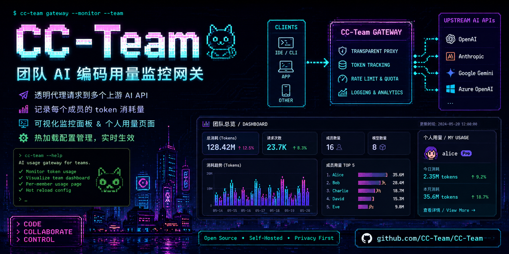

# CC-TEAM

团队 AI 编码用量监控网关。

透明代理请求到多个上游 AI API，记录每个成员的 token 消耗量，提供可视化监控面板、个人用量页面和热加载配置管理。

> 单文件 · 零依赖 · Docker 就绪



## 功能

- **透明代理**：请求/响应原样透传，零影响 LLM 上下文和输出质量
- **多方案并发**：GLM、阿里云 Token Plan、DeepSeek 等多上游配置同时在线，通过 URL 后缀区分
- **虚拟 Key 映射**：多人共享同一上游账号，各自使用 `jx-` 虚拟 Key，用量分人统计
- **协议方案**：每个方案可选择 Anthropic 或 OpenAI-compatible 协议，Claude Code 和 Codex 可共用同一套用户/配额/监控
- **模型别名**：支持通用 `alias=实际模型`，并兼容 `jx-sonnet` / `jx-opus` / `jx-haiku`
- **模型准入**：按方案限制可用模型，拦截未知 Key
- **Token 配额**：方案级 + 用户级每日 token 限额，超限自动拦截
- **自动增长额度**：高强度用户自动增长配额
- **个人用量页**：用户通过虚拟 Key 查看自己的配额、模型明细、趋势图表
- **Token 统计**：按人、按日、按模型、按小时记录 token 消耗
- **Dashboard**：Chart.js 可视化图表（趋势、分布、24小时热力），自动刷新
- **请求分类**：自动识别用户请求、工具调用、子代理请求
- **错误记录**：上报错误实时记录，分页查看
- **熔断保护**：连续失败自动熔断，上游恢复后半开探测
- **限流控制**：每用户最大并发 + 每分钟速率限制
- **登录鉴权**：Dashboard 和设置页面密码保护
- **热加载**：Web 页面修改全部设置，即时生效

## 快速开始

### 方式一：脚本启动（推荐）

自动检测环境、安装 Node.js、生成配置并引导填写，双击即用。

```bash
git clone https://github.com/Linlx0628/cc-team.git
cd cc-team

# macOS / Linux
./start.sh

# Windows
start.bat
```

> 首次运行自动检测 Node.js（没有则自动安装）、自动生成 `config.json` 并引导你完成配置。

### 方式二：Docker

```bash
docker pull linlx/cc-team:latest

# 首次启动 — 自动生成默认配置
docker run -d \
  -p 6789:6789 \
  -v cc-team-config:/app \
  --name cc-team \
  linlx/cc-team:latest

# 编辑配置（填入你的上游地址、API Key、用户等）
docker exec -it cc-team vi /app/config.json

# 重启生效
docker restart cc-team
```

> 首次启动会自动从模板生成 `config.json`，编辑后重启即可。

或者用 docker compose（适合 clone 仓库后使用）：

```bash
git clone https://github.com/Linlx0628/cc-team.git
cd cc-team
cp config.example.json config.json
# 编辑 config.json 填入真实配置
docker compose up -d
```

首次运行会自动从模板创建 `config.json`，编辑后重新启动即可。

### 方式三：直接运行

```bash
cp config.example.json config.json
# 编辑 config.json
node server.mjs
```

## 配置

编辑 `config.json`：

```json
{
  "port": 6789,
  "dashboardPassword": "your-password",
  "profiles": {
    "glm": {
      "suffix": "glm",
      "isDefault": true,
      "apiProtocol": "anthropic",
      "upstream": "https://open.bigmodel.cn/api/anthropic",
      "dailyTokenLimit": 2000000,
      "allowedModels": ["glm-5.1", "glm-5-turbo", "glm-4.7"],
      "defaultModels": {
        "sonnet": "glm-5-turbo",
        "opus": "glm-5.1",
        "haiku": "glm-4.7"
      },
      "modelAliases": {
        "jx-sonnet": "glm-5-turbo",
        "jx-opus": "glm-5.1",
        "jx-haiku": "glm-4.7"
      },
      "openaiStreamUsage": true,
      "responsesAdapter": "none",
      "users": {}
    },
    "openai-codex": {
      "suffix": "openai",
      "isDefault": false,
      "apiProtocol": "openai",
      "upstream": "https://api.openai.com/v1",
      "dailyTokenLimit": 2000000,
      "allowedModels": ["gpt-5", "gpt-5-mini"],
      "modelAliases": {
        "codex-main": "gpt-5",
        "codex-fast": "gpt-5-mini"
      },
      "openaiStreamUsage": true,
      "responsesAdapter": "none",
      "users": {}
    }
  },
  "users": {},
  "proxy": {
    "timeout": 180000,
    "streamTimeout": 600000,
    "maxRetries": 3,
    "retryDelay": 1000,
    "retryableStatusCodes": [429, 502, 503, 504],
    "maxConcurrentPerUser": 5,
    "rateLimitPerMinute": 60,
    "circuitBreakerFailures": 5,
    "circuitBreakerCooldown": 30000
  }
}
```

## 接入 Claude Code

### 默认方案（无后缀）

```bash
export ANTHROPIC_BASE_URL="http://localhost:6789"
export ANTHROPIC_API_KEY="jx-your-virtual-key"
```

默认入口是当前默认方案的别名。默认方案也保留自己的后缀入口，例如：

```bash
export ANTHROPIC_BASE_URL="http://localhost:6789/glm"
export ANTHROPIC_API_KEY="jx-your-virtual-key"
```

### 指定方案（通过 URL 后缀）

```bash
# 使用 DeepSeek 方案
export ANTHROPIC_BASE_URL="http://localhost:6789/deepseek"
export ANTHROPIC_API_KEY="jx-your-virtual-key"
```

所有方案同时在线，无需切换。每个方案都必须有唯一后缀；管理员可在设置页把任一方案设为默认入口。

## 接入 Codex / OpenAI-compatible 客户端

创建方案时把"接口协议"设为 `OpenAI-compatible / Codex`，上游地址填写 OpenAI 或中转商提供的 OpenAI-compatible base URL：

```json
{
  "suffix": "openai",
  "apiProtocol": "openai",
  "upstream": "https://api.openai.com/v1",
  "allowedModels": ["gpt-5", "gpt-5-mini"],
  "modelAliases": {
    "codex-main": "gpt-5",
    "codex-fast": "gpt-5-mini"
  },
  "openaiStreamUsage": true,
  "responsesAdapter": "none"
}
```

Codex 或 OpenAI SDK 填的是 base URL，不是完整 endpoint。Codex 推荐写到 `/v1`：

```toml
model = "gpt-5"
model_provider = "cc-team-openai"

[model_providers.cc-team-openai]
name = "CC-Team OpenAI"
base_url = "http://localhost:6789/openai/v1"
env_key = "OPENAI_API_KEY"
wire_api = "responses"
```

如果 OpenAI 方案被设为默认入口，也可以使用 `base_url = "http://localhost:6789/v1"`。

启动 Codex 前导出虚拟 Key：

```bash
export OPENAI_API_KEY="jx-your-virtual-key"
```

Codex 的模型由 Codex 客户端配置或请求体里的 `model` 决定，例如 `gpt-5`、`qwen3-coder-plus`、`glm-5`。平台侧不需要配置 `jx-sonnet`、`jx-opus`、`jx-haiku`；这些只是 Claude/Anthropic 方案的兼容别名。

默认模式是 OpenAI 透明代理：客户端请求 `/v1/responses`、`/v1/chat/completions`、`/v1/models` 等 OpenAI-compatible 端点时，平台只做虚拟 Key 映射、可选模型别名、限额和 usage 统计，不把 Anthropic `/v1/messages` 转换成 OpenAI 请求。如果你的客户端固定使用 Anthropic 协议，请配置上游的 Anthropic 接口；OpenAI-only 上游需要客户端按 OpenAI 协议访问。

### Aliyun Coding Plan / 只有 Chat Completions 的上游

如果上游像 `https://coding.dashscope.aliyuncs.com/v1` 这样只有 `/v1/chat/completions`，没有 `/v1/responses` 或 `/v1/models`，创建 OpenAI 方案时启用 `responsesAdapter: "chat_completions"`：

```json
{
  "suffix": "aliyun-openai",
  "apiProtocol": "openai",
  "upstream": "https://coding.dashscope.aliyuncs.com/v1",
  "allowedModels": ["glm-5", "qwen3.7-plus", "qwen3.6-plus"],
  "modelAliases": {
    "codex-min": "qwen3.6-plus",
    "codex-max": "qwen3.7-plus",
    "codex-pro": "glm-5"
  },
  "openaiStreamUsage": true,
  "responsesAdapter": "chat_completions"
}
```

Codex 仍然使用 Responses wire API，网关负责把 `/v1/responses` 转为上游 `/v1/chat/completions`，并用 `allowedModels` 本地返回 `/v1/models`：

```toml
model = "glm-5"
model_provider = "cc-team-aliyun"

[model_providers.cc-team-aliyun]
name = "CC-Team Aliyun Coding"
base_url = "http://localhost:6789/aliyun-openai/v1"
env_key = "OPENAI_API_KEY"
wire_api = "responses"
```

## 页面

| 页面 | 地址 | 说明 |
|------|------|------|
| 监控面板 | `http://localhost:6789/dashboard` | 管理员查看全队用量，支持按方案筛选，需登录 |
| 设置页面 | `http://localhost:6789/settings` | 配置方案、用户、配额，需登录 |
| 个人用量 | `http://localhost:6789/usage/你的虚拟Key` | 用户查看自己的用量，无需登录 |
| 用量输入 | `http://localhost:6789/my-usage` | 输入虚拟 Key 跳转个人页面 |
| 健康检查 | `http://localhost:6789/health` | 服务状态，无需登录 |

## 用户管理

所有用户管理在设置页面的"用户管理"弹窗中完成：

1. **添加用户**：点击"添加用户"，自动生成 `jx-` 开头的虚拟 Key
2. **填写信息**：用户名、失效时间（可选）
3. **选择方案**：在"方案真实Key分配"区域先选择要配置的方案
4. **分配真实 Key**：为该方案填入上游真实 API Key；留空表示该用户不能使用此方案
5. **设置配额**：可选，设每日 token 限额（0 = 跟随方案配额）
6. 点击"保存全部"

## Token 配额

### 配额层级

```
用户级配额 > 方案级配额 > 不限制
```

- **方案配额**：设置页 → "每日Token配额" → 设一个数字（总Token = 输入+输出）
- **用户配额**：用户管理弹窗 → 方案真实Key分配表格 → "每日配额"列
- **0 = 不限制**，null = 不限制
- **北京时间每日0点自动重置**

### 超限行为

用户达到限额时，请求返回 429：

```json
{
  "error": "今日Token额度已用完。已用: 500,123, 限额: 500,000。额度将于北京时间次日凌晨重置。查看用量详情: http://host/usage/jx-xxx",
  "type": "quota_exceeded",
  "quota": { "used": 500123, "limit": 500000, "remaining": 0, "source": "个人配额" },
  "usageUrl": "http://host/usage/jx-xxx"
}
```

### 个人用量页面

每个用户通过 `http://host/usage/虚拟Key` 查看：

- 配额状态（已用/剩余/限额）
- 今日24小时趋势图
- 近7天趋势图
- 按模型明细表
- 自动30秒刷新

### 个人用量 API

```bash
curl -H "Authorization: Bearer jx-your-key" http://localhost:6789/api/my-usage
```

返回 JSON：用户名、配额、今日用量、模型明细、7日趋势。

## 方案说明

### 多方案并发与默认入口

每个方案独立配置上游地址、模型列表、用户分配和 URL 后缀。设置页左侧用于编辑方案；所有方案始终同时在线。

默认入口是一个无后缀别名：`http://host:6789/v1/*` 会路由到被标记为默认入口的方案。该方案自己的后缀入口仍然可用，例如 `http://host:6789/glm/v1/*`。

### 模型别名

Anthropic 方案中，`jx-sonnet` / `jx-opus` / `jx-haiku` 自动映射到实际模型。OpenAI/Codex 方案中，客户端直接发送真实模型名；`modelAliases` 只用于可选短别名，例如 `codex-main=gpt-5`。

### 模型准入

`allowedModels` 限制可用模型。不在列表的请求返回 403。`null` 或 `["*"]` 不限制。

## API 端点

| 端点 | 方法 | 说明 |
|------|------|------|
| `/v1/*` | * | 默认入口代理转发至上游 |
| `/:suffix/v1/*` | * | 指定方案代理转发至上游 |
| `/dashboard` | GET | 监控面板（需登录） |
| `/settings` | GET | 设置页面（需登录） |
| `/usage/:key` | GET | 个人用量页面（Key 即认证） |
| `/my-usage` | GET | 输入 Key 或查询用量 |
| `/api/my-usage` | GET | 个人用量 JSON（Bearer Key 认证） |
| `/api/stats` | GET | 全队统计 JSON（需登录） |
| `/api/settings` | GET | 当前设置 JSON |
| `/api/settings-save` | POST | 保存设置（表单提交） |
| `/api/profile/switch` | POST | 兼容旧客户端，重新加载指定方案 |
| `/api/profile/save` | POST | 创建新方案 |
| `/api/profile/default` | POST | 设置默认入口方案 |
| `/api/profile/delete` | POST | 删除方案 |
| `/api/global-user/save` | POST | 保存用户管理 |
| `/api/global-user/delete` | POST | 删除用户 |
| `/api/clear-errors` | POST | 清除错误记录 |
| `/api/circuit-breaker-reset` | POST | 重置熔断器 |
| `/health` | GET | 健康检查 |

## 日志说明

所有日志为中文，每个请求有开始/结束分割线：

```
── 请求开始 ── 张三 [用户请求] 模型=jx-opus→glm-5.1 ──
[映射] 张三 虚拟key=jx-usbb1IWHX... → 真实key=cf0b2ff0ac0... 请求模型=jx-opus → 实际=glm-5.1
[SSE] 张三 第1条 类型=message_start
[Token] 张三 [用户请求] model=glm-5.1 输入=526 输出=1099 缓存写=0 缓存读=59226
── 请求结束 ── 张三 ──
```

**请求分类**：`[用户请求]` 手动输入、`[工具调用]` Claude 自动执行、`[子代理]` 子任务

## 数据存储

- `config.json` — 方案、用户、配额、设置（通过 Web 页面修改，自动迁移）
- `data.json` — token 用量统计数据，30 秒自动落盘，关机时写入

## 代理透明度

默认情况下代理对请求/响应内容保持透明：

- 请求 body（messages/input、system prompt、参数）原样透传；OpenAI Chat Completions 流式请求会在启用 `openaiStreamUsage` 时合并 `stream_options.include_usage=true`
- 响应 body（JSON / SSE 流）逐字节转发
- 只替换 `Authorization` header 实现 Key 映射
- 本地处理延迟 < 1ms

例外：OpenAI 方案启用 `responsesAdapter: "chat_completions"` 后，网关会把客户端 `/v1/responses` 请求转换为上游 `/v1/chat/completions`，并本地返回 `/v1/models`。

## 技术栈

- Node.js 内置模块（http、https、fs、crypto），零外部依赖
- Chart.js 4.4（CDN 引入，Dashboard 和个人页面使用）

## License

MIT
