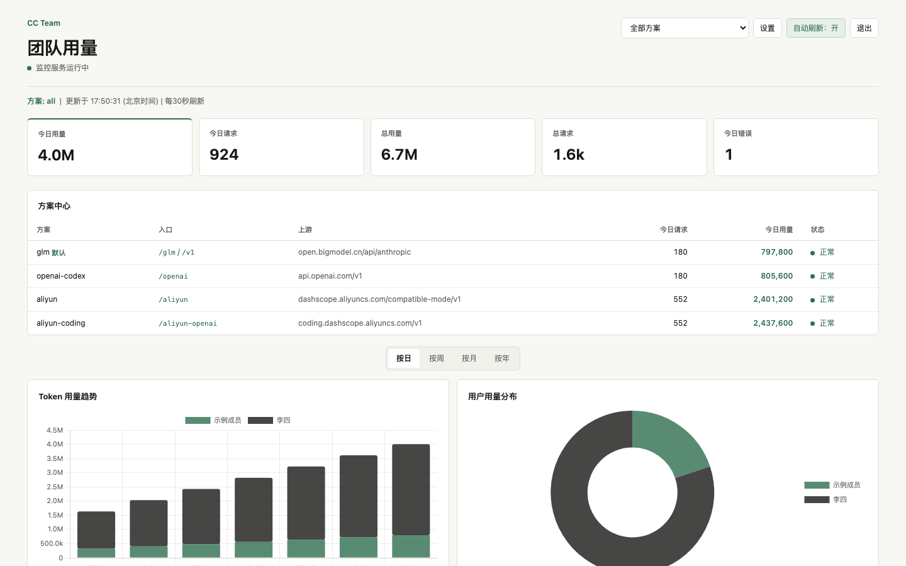

<p align="center">
  
</p>

# CC Team

面向 Claude Code 与 Codex 团队的 AI 编码网关。CC Team 将请求透明转发到多个兼容上游，通过虚拟 Key 管理成员访问，并提供 Token 统计、每日配额、错误记录和明亮极简的可视化工作台。

Claude Code 走 Anthropic Messages 协议（`/v1/messages`），Codex 走 OpenAI Responses 协议（`/v1/responses`）。两种协议的方案完全隔离：各自路由、各自默认组 failover，互不接管。不提供 OpenAI Chat Completions 兼容接口。



## 功能

- 多个 Anthropic Messages 上游同时在线，通过 URL 后缀区分方案
- Codex 透传接入：OpenAI Responses 协议（`/v1/responses`），上游需为原生 Responses 端点（如智谱 `https://open.bigmodel.cn/api/v1`）
- Responses 方案组独立 failover，与 Anthropic 方案严格隔离
- 每位成员使用独立的 `jx-` 虚拟 Key，真实上游 Key 不暴露
- 按成员、方案、模型、日期和小时统计 Token 用量（含缓存 token）
- 方案级与成员级每日配额，北京时间零点重置
- 配额倍率：高峰/低谷时段按倍率计权扣额，并可细分到每个模型，低谷与廉价模型自动更省额度
- 统一的 `alias=实际模型` 模型别名配置，对 Claude Code 与 Codex 同样生效
- 模型准入、并发限制、速率限制、重试和熔断保护
- 熔断冷却后自动探测回切，组头恢复即收回流量，套餐额度不被闲置
- 桌面单屏 Dashboard、设置页与成员个人用量页
- Dashboard 内置用户用量、周期明细、方案中心、配额倍率和错误记录工作区
- 全部方案视图下用户配额按方案展开：管理端每方案一列，成员端每方案一张卡，一屏看清各方案额度占用
- 每日签到：成员每天签到一次，随机奖励 token 进入其全部额度池的当日临时加量
- 加量申请：成员可申请增加用量，新申请即时推送管理员通知，后台一键发放或驳回
- 使用日历：成员个人页的 GitHub 风格年度热力图，逐日点亮使用记录
- 从旧版 `data.json` 预览并导入历史数据
- 创建本地备份后清空配置与请求数据

## 快速开始

### 脚本启动

```bash
git clone https://github.com/Linlx0628/cc-team.git
cd cc-team

# macOS / Linux
./start.sh

# Windows
start.bat
```

### Docker

```bash
docker pull linlx/cc-team:latest

mkdir -p cc-team-data/backups
curl -fsSL https://raw.githubusercontent.com/Linlx0628/cc-team/master/config.example.json \
  -o cc-team-data/config.json
touch cc-team-data/data.db

docker run -d \
  -p 6789:6789 \
  -v "$PWD/cc-team-data/config.json:/app/config.json" \
  -v "$PWD/cc-team-data/data.db:/app/data.db" \
  -v "$PWD/cc-team-data/backups:/app/backups" \
  --name cc-team \
  linlx/cc-team:latest
```

不要把卷直接挂载到整个 `/app`，否则会覆盖镜像内的服务程序。升级容器时保留 `cc-team-data/` 即可。

### 直接运行

```bash
cp config.example.json config.json
npm install
node server.mjs
```

打开 `http://localhost:6789/settings` 完成上游、模型和成员配置。

## 配置

```json
{
  "port": 6789,
  "dashboardPassword": "your-password",
  "profiles": {
    "glm": {
      "suffix": "glm",
      "protocol": "anthropic",
      "isDefault": true,
      "upstream": "https://open.bigmodel.cn/api/anthropic",
      "dailyTokenLimit": 2000000,
      "peakHours": [{ "start": "09:00", "end": "12:00" }],
      "peakQuotaRate": 1,
      "offPeakQuotaRate": 0.5,
      "modelQuotaRates": {
        "glm-5.1-flash": { "peak": 0.3, "offPeak": 0.15 }
      },
      "allowedModels": ["glm-5.1"],
      "modelAliases": {
        "jx-sonnet": "glm-5.1",
        "jx-opus": "glm-5.1",
        "jx-haiku": "glm-5.1"
      },
      "users": {
        "jx-example-user": {
          "key": "real-upstream-key",
          "disabled": false,
          "dailyTokenLimit": null
        }
      }
    },
    "glm-codex": {
      "suffix": "glmcodex",
      "protocol": "responses",
      "upstream": "https://open.bigmodel.cn/api/v1",
      "allowedModels": ["glm-5.3"],
      "modelAliases": { "gpt-5.3": "glm-5.3" },
      "users": {
        "jx-example-user": {
          "key": "real-upstream-key",
          "disabled": false,
          "dailyTokenLimit": null
        }
      }
    }
  },
  "users": {
    "jx-example-user": {
      "username": "示例成员",
      "expiresAt": null,
      "disabled": false
    }
  },
  "responsesProfileGroup": ["glm-codex"],
  "proxy": {
    "timeout": 180000,
    "streamTimeout": 600000,
    "streamIdleTimeout": 120000,
    "stickySessionTtlSeconds": 300,
    "maxRetries": 3,
    "retryDelay": 1000,
    "retryableStatusCodes": [429, 502, 503, 504],
    "maxConcurrentPerUser": 5,
    "rateLimitPerMinute": 60,
    "circuitBreakerFailures": 5,
    "circuitBreakerCooldown": 30000,
    "rateLimitFallbackSeconds": 120
  }
}
```

`modelAliases` 是唯一的模型映射入口。别名目标会自动加入 `allowedModels`；不需要别名时可直接使用真实模型名。

设置页的模型别名为一行一别名的结构化编辑器（别名 / 实际模型 / 每别名上下文长度一一对应，`jx-fable`/`jx-opus`/`jx-haiku`/`jx-sonnet` 可快捷添加也可自定义）；通用别名必填，`allowedModels` 由全部别名（含高峰期覆盖）的实际模型自动汇总生成，不可手填。每个别名的上下文长度写入成员 Codex 接入配置的 models.json。

`jx-sonnet`、`jx-opus` 和 `jx-haiku` 没有特殊的独立配置入口，它们与其他别名一样统一写入 `modelAliases`。

### 粘性会话（缓存亲和）

两种协议都是无状态回放：每轮对话重发完整历史。如果同一会话在组内不同方案间来回切换，每次切换都要重新支付完整 prompt（缓存冷启动）。网关会按会话把请求粘在同一方案上，会话信号按优先级取：`session_id` 请求头（Codex 原生发送）→ 请求体 `prompt_cache_key` → 首轮对话内容摘要。绑定只指向协议组头：由组头服务的一轮刷新绑定，由备选方案服务的一轮清除绑定，因此组头恢复后会话自然回到组头，不会永久留在备选上。可用性永远优先于粘性：被限流/熔断的方案不会因为绑定而被选中。`stickySessionTtlSeconds` 控制绑定有效期（默认 300 秒，0 关闭）。

### 熔断与自动回切

方案连续失败达到 `circuitBreakerFailures` 次即熔断，期间请求自动切到默认组的下一个方案。冷却结束后**自动放行探测请求**：探测成功即关闭熔断、流量切回该方案；探测失败则重新熔断，且**冷却时间指数退避**（×2，最多 8 倍或 5 分钟上限），避免长时间故障期间反复消耗真实请求。上游答复成功后退避立即归零。

这一步对「组头是 Coding Plan 套餐」的配置尤为重要：组头短暂网络故障熔断后必须能自动收回流量，否则套餐额度会被闲置，流量长期留在按量计费的备选方案上。整个过程无需手工重置熔断器；设置页与 Dashboard 方案中心会显示距下次探测的剩余秒数与当前退避倍数。

### 流式空闲看门狗

SSE 流超过 `streamIdleTimeout`（默认 120000ms，0 关闭）没有任何字节到达时，网关立即中断上游并结束客户端响应，同时记录 504，而不是等满 `streamTimeout`。正常思考/输出间隙远小于该值，不受影响。

上游 429 标记方案限流时，若响应带 `Retry-After` 头（秒数或 HTTP 日期），按其指示的时长（15–600s 钳制）标记，比固定 `rateLimitFallbackSeconds` 更精确。

## 接入 Claude Code

默认方案使用无后缀地址：

```bash
export ANTHROPIC_BASE_URL="http://localhost:6789"
export ANTHROPIC_API_KEY="jx-your-virtual-key"
```

指定方案时在地址中加入方案后缀：

```bash
export ANTHROPIC_BASE_URL="http://localhost:6789/glm"
export ANTHROPIC_API_KEY="jx-your-virtual-key"
```

所有方案同时在线。管理员可在设置页选择默认入口，默认方案的后缀入口仍然可用。

## 接入 Codex

Codex 使用 OpenAI Responses 协议。先在设置页创建一个接口协议为 **OpenAI Responses** 的方案，上游填原生 Responses 端点（例如智谱 GLM Coding Plan 的 `https://open.bigmodel.cn/api/v1`），并把该方案加入「Responses 方案组」，给成员分配虚拟 Key。

### 成员一键接入

管理员把一个链接发给成员即可：`http://<服务器地址>:6789/setup/<成员的虚拟Key>`

成员打开后按页面指引三选一：

- **一键脚本**：终端执行 `curl -fsSL "http://<服务器地址>:6789/api/codex-setup/<Key>" | sh`——自动备份并更新 `~/.codex/config.toml`、写入 `~/.codex/models.json`、做连通性检查。脚本幂等可重复执行，只管理 ccteam 相关配置，成员已有的其他 provider、项目信任、MCP 配置全部保留
- **模型目录来自方案配置**：models.json 完全由成员可访问的 Responses 方案里的别名（`modelAliases` + `peakModelAliases`，按配置顺序）生成，默认模型取第一个别名；方案未配任何别名时才回退到 `allowedModels`。管理员改别名后成员重新执行一次脚本即可同步
- **上下文窗口在设置页选**：每个方案可配置「模型上下文窗口」（32K/64K/128K/200K/256K/400K/1M 下拉选择，默认 128K），生成 models.json 时写入每个别名的 `context_window`，Codex 用它显示上下文用量与做压缩阈值
- **手动配置**：复制页面上生成好的 config.toml 片段与 models.json 全文
- **cc-switch 用户**：把生成的 provider TOML 粘贴为自定义供应商；顶层键（`model_catalog_json` 等）建议放进 cc-switch 的公共配置段，切换后注意确认仍在

服务器地址自动取自成员打开页面时使用的地址（`window.location.host`），可手动修改——成员怎么访问到页面，Codex 就怎么访问网关。个人用量页顶部也有「配置 Codex 接入」入口。

### 手写配置参考

默认入口（Responses 方案组按序 failover）：

```toml
# ~/.codex/config.toml
model_provider = "ccteam"
model = "glm-5.3"
model_catalog_json = "~/.codex/models.json"

[model_providers.ccteam]
name = "CC Team Gateway"
base_url = "http://localhost:6789/v1"
wire_api = "responses"
requires_openai_auth = false
supports_websockets = false
experimental_bearer_token = "jx-your-virtual-key"
```

指定方案时把 base_url 改为带后缀地址（`http://localhost:6789/<suffix>/v1`，如 `http://localhost:6789/glmcodex/v1`）。

说明：

- Codex 的 `Authorization: Bearer jx-...` 与 Claude Code 共用同一套虚拟 Key 与成员体系
- `/v1/models` 由网关本地合成（来自方案的允许模型与别名），不会打到上游
- 模型别名（如 `gpt-5.3=glm-5.3`）与高峰时段切换对 Codex 同样生效
- Responses 方案与 Anthropic 方案完全隔离：`/v1/messages` 永远不会落到 Responses 方案，反之亦然；交叉访问会返回明确的错误提示
- 网关对 Responses 流量做字节级透传，只在旁路解析用量（含 `cached_tokens` 缓存统计），协议正确性由上游保证

## 用户与配额

用户管理分为两层：

1. 全局用户保存虚拟 Key、名称、失效时间和禁用状态。
2. 每个方案为该虚拟 Key 分配真实上游 Key、方案禁用状态和可选个人配额。

配额优先级为：

```text
用户配额 > 方案配额 > 不限制
```

达到限额时返回 429、`type: "quota_exceeded"` 和距北京时间下一个零点的 `Retry-After`。配额、并发和速率限制产生的 429 都会进入错误记录。

### 配额倍率（峰谷 + 按模型计权）

每个方案可以配置配额倍率，把「消耗多少 token」和「扣多少额度」解耦：

```text
扣除额度 = (输入 + 输出) × 该模型在当前时段的倍率
```

倍率分两层，**模型级优先，未覆盖的模型回落方案默认**：

```text
模型倍率（modelQuotaRates[实际模型].peak / .offPeak）
  ↓ 未配置则回落
方案默认倍率（peakQuotaRate / offPeakQuotaRate）
```

- 命中「高峰时段」用峰时倍率，其余时间用谷时倍率（**不设高峰时段 = 全天按低谷倍率**，设置页会就此告警）
- 默认均为 `1.0`，即与不启用倍率时的行为完全一致
- 模型倍率按**实际上游模型名**索引（不是别名）——上游回包与统计表都用真实模型名，且高峰别名覆盖会让多个别名指向同一模型，按别名索引会产生歧义。设置页的模型下拉自动来自别名目标，避免手打错名字导致静默回落
- 倍率在请求落库时结算并写入 `weighted_tokens`，**改倍率只影响之后的请求，已产生的消耗不会重算**。需要追溯补偿请用上面的手工临时额度
- 统计报表、图表、导出始终显示真实 token，倍率只作用于配额判定
- 自动配额调整同样读取计权用量，不会把折扣二次放大

建议以「高峰期 Coding Plan 旗舰模型 = 1.0」为基准，让名义限额有确切含义（1 额度 = 1 个高峰期基准 token）：

| 方案类型 | 高峰 | 低谷 | 说明 |
| --- | --- | --- | --- |
| Coding Plan（如 GLM） | 1.0 | 0.5 | 低谷期上游闲置，同样的额度更耐用 |
| 按量计费（如 DeepSeek） | 2.0 | 1.5 | 真实成本更高，用倍率显式定价 |

在此之上给便宜的档位单独定价，例如 `glm-5.3-flash` 配 峰 0.3 / 谷 0.15 —— 成员用 flash 干活几乎不消耗额度，自然被引导到低成本模型。

**成员怎么看懂**：个人用量页提供「配额价目表」，按当前时段列出每个别名此刻的倍率（最便宜的排最前），花钱之前就能知道哪个模型贵；「今日模型请求」表把实际 Token 与计入配额并排显示，倍率列是当日实际计权比例（跨高峰边界或期间调过倍率时会落在两档之间）。混合倍率的一天不会被粉饰成单一数字：页面顶部标注的是「当前时段默认倍率」，综合比例另行给出。

**管理员怎么看清**：Dashboard 数据工作区新增「配额倍率」标签页，一张表列出每个方案×模型的当前倍率、峰/谷两档、今日实际与计入配额、今日请求数，按当前最贵的排在最前。单独定价的行有底色与徽章，未被任何别名引用但仍有配置或流量的模型也会列出（不会静默消失）。表头汇总当前时段、单独定价模型数与今日综合倍率。当某行的实际计权比例与当前倍率不同（跨了高峰边界或期间调过倍率），会额外标出「实收 ×N」而不是假装一致。

倍率变更会写入操作审计日志：方案默认倍率记旧值→新值，模型倍率逐个模型记新增/取消/调整。超额 429 的文案会带上实际 token、抵扣数额、下一次倍率切换时刻，以及该模型是否为单独定价。

### 跨方案配额总览

一个成员在每个方案下各有一份配额，所以在「全部方案」视图里，任何单一的配额数字都无法表达有效信息。管理端与成员端各有一套展开形态。

**Dashboard（管理员）**：用户用量表的「配额」列自动展开为**每个有配额的方案一列**：

```text
用户    状态   今日      GLM        DeepSeek    最后活跃
                       /glm·套餐   /ds·按量
Alice   在线   1.2M     100% ███   12% ▌       3分钟前
Bob     离线   380k      20% ██    -           2小时前
```

- 方案名只在表头写一次，不在每个用户下重复，方案变多时仍然可读
- 单元格是百分比 + 进度条，悬停显示已用/上限、配额来源（个人或方案级）、剩余、倍率与实际 token、当日临时加量与重置状态
- 无配额或无访问权限的组合显示 `-`（悬停说明原因），不画空条
- 无任何配额的方案不会成为列；被禁用、Key 过期或未分配真实 Key 的成员不会出现在矩阵里
- 表头汇总「共 N 项配额 · X 项已用尽 · Y 项超过 80%」，并列出最紧张的前三项，不用逐行看
- 「只看配额」按钮折叠 6 个 Token 统计列，方案多时避免横向滚动；选择记在浏览器本地
- 协议筛选（Anthropic / OpenAI）会同步收窄列；选中单个方案时回到原来的单列形态

**个人用量页（成员）**：选「全部可用方案」时，顶部汇总卡下方增加「各方案配额」卡片区，每个可用方案一张卡：

```text
各方案配额   共 3 个可用方案，2 个有配额 · 1 个已超 80%

┃ GLM              82%     ┃ DeepSeek          13%    ┃ 阿里云         不限
┃ /glm                     ┃ /ds                      ┃ /aliyun
┃ ████████░░               ┃ █░░░░░░░░░               ┃
┃ 已用 1.64M / 2.00M（个人配额）  已用 1.05M / 8.00M（方案配额）  今日已用 210k
┃ 剩余 360k · 实际 3.28M，已抵扣 1.64M                          该方案无每日上限
┃ 20:00 后转入高峰 ×1
┃ [默认入口][Claude Code][低谷 ×0.5]  [Claude Code]      [Codex]
```

- **聚合数字会骗人**：只要有一个方案不限额，聚合配额就整体显示为「无限制」，其他方案真实存在的上限就被隐藏了；即便都有上限，加总后的一根进度条也说不出是哪个方案快满了。卡片解决的正是这两点
- 每张卡显示百分比 + 进度条、已用/上限、配额来源、剩余，以及该方案自己的倍率、实际 token 与抵扣额、下一次倍率切换时刻
- 左边框按紧张程度着色（<80% 绿 / ≥80% 橙 / ≥90% 红），不限额的方案显示「不限」并标注「该方案无每日上限」而不是被省略
- 最紧张的排最前；标题行汇总可用方案数、有配额方案数与超 80% 的数量
- 选中具体方案时不显示卡片区（此时顶部那根进度条本身就是精确的）

### 手工临时额度

在设置页「用户管理」弹窗中，每个方案内用户可以使用「临时额度」按钮进行当日手工干预（接口 `POST /api/quota/daily-op`）：

- **临时加量**：给该用户今天额外加 N tokens，生效额度 = 基础配额 + 加量。只对当日（北京时间）生效，次日自动失效，不改动永久每日配额，与自动配额调整互不干扰。
- **重置今日用量**：将该用户当日已用量清零，配额立即恢复满额可继续使用。实现为用量基线偏移——用量统计与报表数据保留不动。
- **撤销今日手工操作**：删除该用户当日全部手工额度记录，恢复原始判定。

手工操作按「方案 × 用户 × 北京日期」记录在 `quota_daily_ops` 表中，跨日后旧行自动不再命中，无需任何回退任务。临时加量变更会写入配额调整历史（标记「手动」，不影响自动调整的冷却计算）。用户与方案均未设置每日配额（无限制）时，上述操作不可用。

删除用户会同时删除该虚拟 Key 的成员汇总、每日数据、模型与小时明细、错误和配额调整记录。

## 每日签到与加量申请

成员侧的趣味功能，入口全部在「我的用量」页；全局开关与参数在设置页「签到与加量申请」区块配置（存于 `config.json` 顶层 `checkIn` / `quotaRequest` 字段）。

### 每日签到

- 每人每天（北京时间）可签到一次，奖励为配置区间内的随机 token（默认 1 万 ~ 10 万），同一次抽取的数值加入该成员**所有可访问额度池**的当日临时加量，次日自动失效。
- 签到奖励与管理员手工临时加量**累加**，不互相覆盖；签到记录永久存于 `check_ins` 表（含连续天数、累计统计）。
- 接口：`POST /api/checkin`（Bearer 虚拟 Key）；状态随 `/api/my-usage` 下发。

### 加量申请

- 成员选择要申请的**额度池**并填写理由提交；固定规则：每人每天限提交 1 次，且**提交不占用次数**——只有管理员「发放加量」后才计入每周处理上限（默认 3 次，可配，0 相当于关闭；驳回不计入），每周一（北京时间）刷新。
- 新申请通过已配置的通知渠道（飞书/钉钉/企微/Server酱/Bark）即时推送管理员，并在设置页侧栏「加量申请」中排队（带待处理数角标）。
- 管理员可「发放加量」——额度池默认为成员申请的池（可改选），数量由管理员决定，以当日临时加量发放并自动标记已处理；或「驳回」并留一句备注。成员在自己的页面可以看到每次申请的状态与备注。
- 申请存于 `quota_requests` 表；接口：`POST /api/quota-request`（成员）、`GET /api/quota-requests` / `POST /api/quota-request/grant|update`（管理端）。

### 使用日历

「我的用量」页的「使用日历」以 GitHub 贡献图的样式展示过去一年（371 天）的逐日用量：颜色分级按输入+输出总量的分位数动态计算，悬浮查看计权用量与请求数，并汇总活跃天数、最长连续与最高单日。数据直接来自 `usage_daily` 表（永久保留），无额外存储。

## 数据管理

数据管理是设置页中的独立全局功能，不属于当前选中的单个方案。导入时可以将旧数据来源分别映射到现有方案；清空操作作用于整个系统。

### 导入旧版 data.json

设置页的“旧数据导入”支持旧版顶层结构和 `_profiles` 多方案结构：

1. 选择文件并预览日期范围、成员数、请求数和来源方案。
2. 为每个来源方案选择目标方案或明确跳过。
3. 选择“合并现有数据”或“替换全部请求数据”。
4. 替换模式需要再次输入后台密码。

合并模式使用文件 SHA-256 指纹防止重复导入。所有写入都在 SQLite 事务中完成；替换模式会先备份数据库。

### 清空全部数据

危险操作区要求输入后台密码。执行前会将 `config.json` 和 SQLite 复制到 Git 忽略的 `backups/`，然后清除全系统的方案、成员、密钥、配额、统计、错误和导入记录。端口、后台密码和代理参数保留，服务进入可继续访问设置页的未配置状态。

## 操作审计日志

设置页侧栏的「操作日志」记录一切变化，数据存于 SQLite 的 `audit_log` 表（保留最近 3000 条，`GET /api/audit-log?limit=&offset=&category=` 查询）。每条记录带独立的 `category` 类型字段，筛选互不混杂，五类来源：

- **管理操作**（`admin`，含来源 IP）：登录/退出（含失败尝试）、保存设置（自动列出变更字段）、方案新建/删除/设为组头/设置 failover 链、用户管理（逐用户列出配额增减与禁用变化）、用户删除、当日临时加量/重置、清除限流/粘性/熔断/错误、统计残留删除、旧数据导入、清空全部数据。
- **系统自动事件**（`system`）：上游限流标记与到期/手动恢复、熔断器开启/半开探测/关闭、failover 自动切换（组头不可用 → 备选取管，按状态变化去重）与组头恢复接管、每日自动配额调整。
- **认证事件**：管理员登录成功/失败（失败记录来源 IP）。
- **签到记录**（`checkin`，角色=成员）：每日签到成功与奖励数额、受益额度池。
- **加量申请**（`request`）：成员发起申请（含理由与期望数量）、管理员发放加量/驳回。

审计日志不记录任何真实上游 Key 或密码，用户虚拟 Key 一律脱敏。「清空全部数据」不会删除审计记录——清空动作本身会被记录。

## 请求日志

每个代理请求结束时追加一行 JSON 到 `logs/requests-YYYY-MM-DD.log`（北京时间日期，JSONL 格式），保留最近 30 天（打开当天日志时自动清理更早的文件）。每行字段：

| 字段 | 含义 |
|---|---|
| `t` | 请求完成时间（ISO） |
| `user` / `key` / `ip` | 用户名、脱敏虚拟 Key、来源 IP |
| `proto` / `src` | 协议（anthropic/responses）、请求来源（用户请求/工具调用/子代理） |
| `model` / `servedModel` | 请求的模型（别名）、响应中的实际模型 |
| `profile` | 实际服务的方案名（被拒绝的请求为空） |
| `in` / `out` / `cacheC` / `cacheR` | 输入/输出/缓存写入/缓存读取 token |
| `status` / `ms` | 返回给客户端的状态码、耗时毫秒 |
| `aborted` | 客户端是否中途断开 |

覆盖全部用户侧结果：代理成功/失败、配额 429、模型 403、未知 Key 403、熔断 503 等。**不记录对话内容**（提示词与回复不落盘），与统计和审计日志的隐私边界一致。日志目录已加入 `.gitignore`。

## 事件通知推送

设置页「全局数据管理 → 通知设置」可将系统故障/恢复事件实时推送到你的群或手机，多渠道同时发送：

- **IM 群机器人**：飞书、钉钉、企业微信——粘贴各自的群机器人 Webhook 地址即可。
- **手机推送**：Server酱（SendKey，推送到微信）、Bark（DeviceKey，iOS 推送；可选自建服务器地址）。

推送的事件（与审计日志的系统事件一致）：

- 故障：方案被上游限流、failover 自动切换到备选方案、熔断开启。
- 恢复（可关闭）：限流到期自动恢复、组头恢复接管流量、熔断关闭半开探测成功。

同类事件在冷却时间内（默认 300 秒，可配）只推送一次，防止抖动刷屏。「发送测试通知」用表单当前值验证各渠道连通性（无需先保存）。推送为尽力而为：渠道失败只记录日志，不影响代理请求；配置变更本身会记入审计日志。无需任何新增依赖。

## 从旧版本升级

- 旧 `defaultModels` 会迁移为普通 `modelAliases`；已经存在的同名 `modelAliases` 优先。
- `apiProtocol`、`openaiStreamUsage` 和 `responsesAdapter` 等旧协议字段会被移除。
- 旧 OpenAI 协议方案（`apiProtocol: "openai"`，Chat Completions 时代）不再受支持，升级时会先在 `backups/` 中备份 `config.json` 和 SQLite，再删除这些方案及其关联统计数据。新的 Responses 支持使用独立的 `protocol` 字段，与旧字段无关。
- 所有既有方案会自动补上 `protocol: "anthropic"` 字段；`responsesProfileGroup` 初始化为空。
- 如果仍需保留旧 OpenAI 方案，请在升级前备份整个数据目录，并继续使用支持该协议的旧版本。

## 页面

| 页面 | 地址 | 说明 |
| --- | --- | --- |
| 管理面板 | `http://localhost:6789/dashboard` | 单屏查看指标、图表、用户、周期明细、方案和错误；顶部"全部 / Claude Code / Codex"三段开关可按协议切换全部统计视角 |
| 设置 | `http://localhost:6789/settings` | 双标签页（Claude Code / Codex）分别管理各自协议的方案、默认入口与方案组 |
| 个人用量 | `http://localhost:6789/usage/虚拟Key` | 指定成员的用量页面，方案下拉标注所属协议 |
| Key 查询 | `http://localhost:6789/my-usage` | 输入虚拟 Key 查询 |
| 健康检查 | `http://localhost:6789/health` | 服务与熔断状态 |

### 两种协议的默认入口互不影响

Anthropic 默认组只管 Claude Code 的 `/v1` 入口，Responses 组只管 Codex 的 `/v1/responses` 入口；把某个 Codex 方案设为 Responses 默认，Claude Code 的请求路径、路由和 failover 完全不变（反之亦然）。设置页的两个标签页分别展示各自的"默认入口"徽章和方案组编辑器，两边的操作只在各自协议内生效。

### Dashboard 协议分类

`/api/stats` 支持可选的 `protocol=anthropic|responses` 参数（不传则聚合全部，行为与旧版一致）。管理面板的三段开关切换后，卡片、六张图表、用户表、错误表和明细表整体切换到该协议的方案集合；方案中心表格按协议分节展示，两个协议的组头都带"默认"徽章。

## 主要接口

Anthropic Messages 代理使用虚拟 Key 鉴权。管理类写入接口除登录外，均要求管理员会话和 CSRF 校验。

| 端点 | 方法 | 说明 |
| --- | --- | --- |
| `/v1/messages` | POST | 默认方案的 Anthropic Messages 代理 |
| `/:suffix/v1/messages` | POST | 指定方案的 Anthropic Messages 代理 |
| `/v1/responses` | POST | Responses 方案组的 OpenAI Responses 代理（Codex 入口，组内 failover） |
| `/:suffix/v1/responses` | POST | 指定 Responses 方案的代理 |
| `/v1/models`、`/:suffix/v1/models` | GET | 本地合成的模型列表（Responses 池，需虚拟 Key） |
| `/api/stats` | GET | 团队统计；可选 `protocol=anthropic\|responses` 按协议过滤 |
| `/api/my-usage` | GET | Bearer Key 对应的个人统计（含签到状态、申请状态与使用日历数据） |
| `/api/checkin` | POST | 每日签到（Bearer Key） |
| `/api/quota-request` | POST | 发起加量申请（Bearer Key） |
| `/api/quota-requests` | GET | 加量申请列表（管理端） |
| `/api/quota-request/grant` | POST | 发放加量并标记已处理（管理端） |
| `/api/quota-request/update` | POST | 驳回或标记申请（管理端） |
| `/api/settings` | GET / POST | 读取或更新设置 |
| `/api/settings-save` | POST | 保存设置页表单 |
| `/api/profile/save` | POST | 创建方案 |
| `/api/profile/default` | POST | 设置方案组默认入口 |
| `/api/profile/delete` | POST | 删除方案 |
| `/api/global-user/save` | POST | 保存用户与方案分配 |
| `/api/global-user/delete` | POST | 删除用户及其可识别历史 |
| `/api/data-import/preview` | POST | 预览旧数据与方案映射 |
| `/api/data-import/apply` | POST | 合并或替换导入 |
| `/api/data-clear` | POST | 验证密码并清空全部数据 |

`/v1/chat/completions` 和 `GET /v1/responses/{id}` 会明确返回不支持，不会转发到上游。

## 数据文件

- `config.json`：方案、成员、Key、配额和代理配置
- `data.db`：SQLite 统计、错误、配额历史和导入指纹
- `backups/`：破坏性迁移、替换导入和数据清空前的本地备份

运行中的旧版 `data.json` 可通过设置页导入。首次启动且 SQLite 为空时，服务也会自动迁移同目录下的旧文件并将其重命名为 `data.json.migrated`。

数据库结构变更（如为配额倍率新增的 `weighted_tokens` 列，覆盖 `usage_daily` / `usage_daily_hourly` / `usage_daily_model` 三张表）在启动时幂等执行：先把整库备份到 `backups/`，再加列并按倍率 1.0 回填历史数据，重启不会重复执行。**升级后不建议回滚到旧版本**——旧版写入不含该列，会导致配额少算。

## 技术栈

- Node.js HTTP/HTTPS 服务
- better-sqlite3
- Chart.js 4.4

## License

MIT
